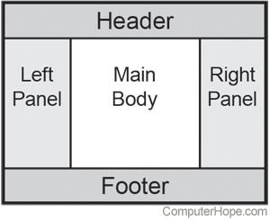

Task: Develop a React app, implementing Holy Grail fig.1. Header and Footer should be sticky. Each block should have a background image. There should be a button in the center of the Body, when you press it all pictures should move randomly, and the button should also change its own color. As background you should use 5 attached pictures.

Requirements:
    • React 18 (last possible version) with Typescript. 
    • Jest, RTL or enzyme for testing.
    • Plain CSS/HTML.
    • Screen resolutions: desktop

